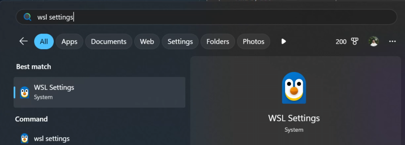
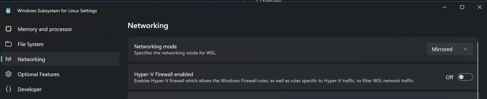
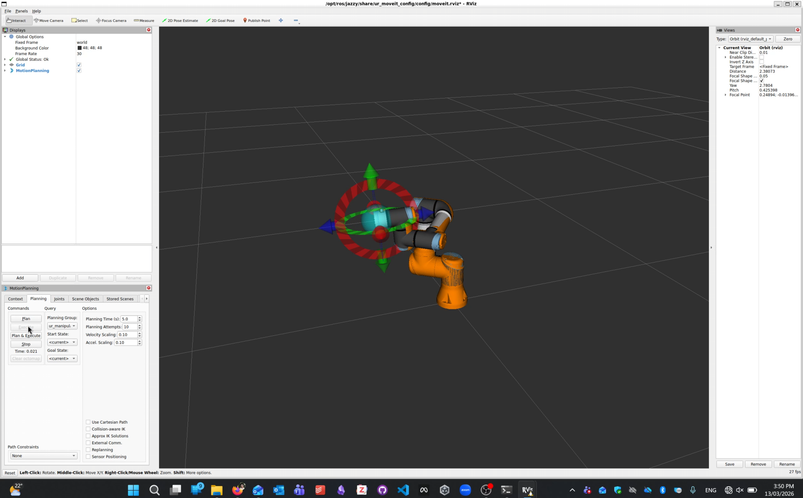
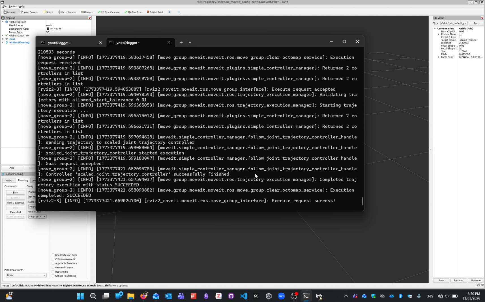

# WSL2 Mirrored Networking

This guide explains how to enable **mirrored networking** in WSL2 so that your Ubuntu environment can access devices on the same network as your Windows machine.

This is useful when working with hardware such as ROS 2 robots on the same network.

The original Microsoft documentation for WSL networking can be found here:

**Official Guide**

https://learn.microsoft.com/en-us/windows/wsl/networking


# 1. Set WSL Networking Mode to Mirrored

On Windows, open the Start menu and search for **WSL Settings**.



In **WSL Settings**, go to **Networking** then set:

- **Networking mode** → `Mirrored`
- **Hyper-V Firewall enabled** → `Off`



Mirrored networking allows WSL to better access the same network interfaces as Windows, which is useful when communicating with robots and other hardware on the local network.

# 2. Allow Hyper-V Firewall Inbound Traffic

Open **PowerShell as Administrator**.


Run the following command:

```powershell
Set-NetFirewallHyperVVMSetting -Name '{40E0AC32-46A5-438A-A0B2-2B479E8F2E90}' -DefaultInboundAction Allow
```

This allows inbound network traffic to the WSL virtual machine through the Hyper-V firewall.

# 3. Restart WSL

After changing the networking settings, if you have WSL running, you need to restart it for the changes to take effect.

In PowerShell, run:

```powershell
wsl --shutdown
```

Then launch your Ubuntu WSL terminal again.

# 4. Test with your robotic hardware

At this point, WSL should be able to communicate more reliably with devices on the same network as the Windows host.

In our testing, we were able to control a **UR3e** robot from WSL using the [ROS 2 Universal Robots driver](https://github.com/UniversalRobots/Universal_Robots_ROS2_Driver) and its MoveIt config.

Example:





# Note on real-time drivers

Although mirrored networking works well for many workflows, some ROS drivers expect high-rate real-time communication.

For example, the Universal Robots driver updates at around **500 Hz** by default, so timing or communication warnings can still appear when running from WSL2.
