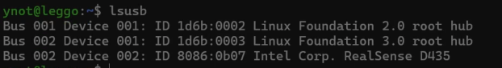
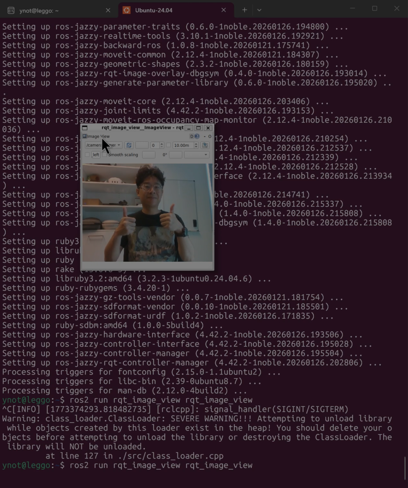
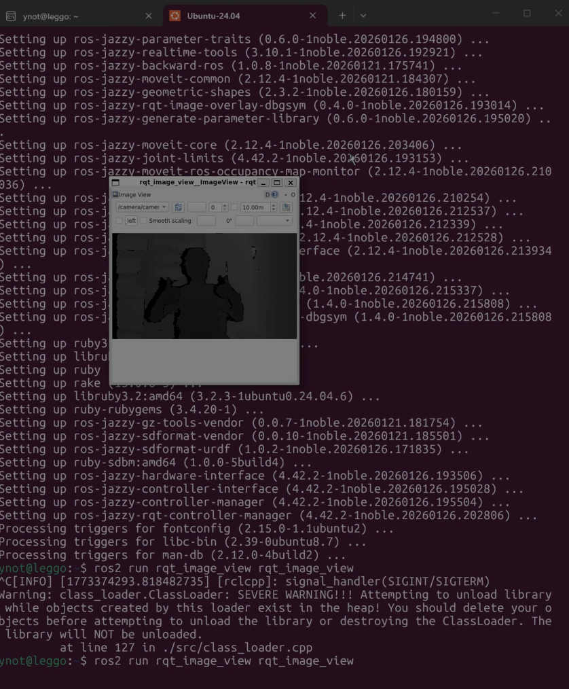

# USB Passthrough to WSL2 (for cameras and sensors)

This guide explains how to enable **USB passthrough from Windows into WSL2** so that Linux applications running inside WSL can directly access USB devices.

We will use the **Intel RealSense D435** camera as an example, using its ROS2 wrapper to demonstrate how to access the camera from WSL2. The mechanism used is **USB/IP**, implemented on Windows through the **usbipd-win** tool.

The original Microsoft documentation for this feature can be found here:

**Official Guide**

https://learn.microsoft.com/en-us/windows/wsl/connect-usb


# 1. Install usbipd-win on Windows

WSL2 does not natively support USB passthrough. Instead, Microsoft recommends using the open-source **usbipd-win** project which implements the USB/IP protocol and allows Windows to share USB devices with WSL2.

Project repository:

https://github.com/dorssel/usbipd-win

Quick download (latest releases):

https://github.com/dorssel/usbipd-win/releases

Download the `.msi` installer and run it (x64 for Intel/AMD CPUs, arm64 for ARM-based devices).

# 2. Share a USB Device with WSL

First, make sure your WSL is running and you have a terminal open.

Then connect your USB device to the Windows machine.

For this tutorial we will use the **Intel RealSense D435** camera.

## Open PowerShell as Administrator

Search for **PowerShell**, right-click it, and select **Run as administrator**.


## List Connected USB Devices

Run:

```powershell
usbipd list
````

Example output:

```text
BUSID  VID:PID    DEVICE
4-1    8086:0b07  Intel(R) RealSense(TM) Depth Camera 435
```

Take note of the **BUSID** for the device you want to connect to WSL.

Example:

```
4-1
```

## Share the Device with WSL

First **bind** the device so Windows allows it to be shared:

```powershell
usbipd bind --busid 4-1
```

Then **attach** it to WSL:

```powershell
usbipd attach --wsl --busid 4-1
```

Replace `4-1` with your device BUSID.

Once attached:

* the USB device becomes accessible inside **WSL**
* the device will **no longer be accessible to Windows applications** while attached


# 3. Verify the Device in Ubuntu

In your **Ubuntu WSL terminal**.

Run:

```bash
lsusb
```

Example output:

```text
Bus 002 Device 002: ID 8086:0b07 Intel Corp. RealSense D435
```

This confirms that the USB device is now visible to Linux.



# 4. (for RealSense camera) Install udev rules

If you are using a **RealSense camera**, Intel provides **udev rules** so the device can be accessed without root permissions.

Important:

**The RealSense camera must be disconnected before installing the rules.**

If the device is connected, the script may fail to install permissions correctly.

Detach the device first from Windows:

```powershell
usbipd detach --busid 4-1
```

or just unplug the device.


## Download the rules and install

Inside Ubuntu:

```bash
mkdir -p ~/realsense_setup/config
cd ~/realsense_setup
````

Download the RealSense udev rules file into the `config` directory (this location is expected by the setup script):

```bash
curl -L -o config/99-realsense-libusb.rules \
https://raw.githubusercontent.com/IntelRealSense/librealsense/master/config/99-realsense-libusb.rules
```

Download the setup script:

```bash
curl -L -O \
https://raw.githubusercontent.com/IntelRealSense/librealsense/master/scripts/setup_udev_rules.sh
```

Run the script:

```bash
./setup_udev_rules.sh
```

Example output:

```
Setting-up permissions for RealSense devices
udev-rules successfully installed
```

---

Reconnect the device again.

From Windows PowerShell:

```powershell
usbipd attach --wsl --busid 4-1
```

Then confirm again in Ubuntu:

```bash
lsusb
```
You should see the device again, and now it should be accessible without root permissions.

# 5. (for RealSense camera) Test with ROS2

Install the RealSense driver, wrapper, and useful ROS visualisation tools.

```bash
sudo apt update

sudo apt install ros-$ROS_DISTRO-librealsense2*

sudo apt install ros-$ROS_DISTRO-realsense2-*

sudo apt install ros-$ROS_DISTRO-rqt*

sudo apt install ros-$ROS_DISTRO-image*
```

These packages provide:

* **librealsense2** – Intel RealSense SDK
* **realsense2 ROS wrapper** – ROS2 driver for RealSense cameras
* **rqt tools** – GUI debugging and visualization tools
* **image transport plugins** – required for compressed image streaming

---

Once the packages are installed, you can verify that the camera works.

Launch the RealSense ROS2 driver:

```bash
ros2 launch realsense2_camera rs_launch.py
```

In another WSL terminal, open an image viewer:

```bash
ros2 run rqt_image_view rqt_image_view
```

This should display image streams from the camera.

Example output:




